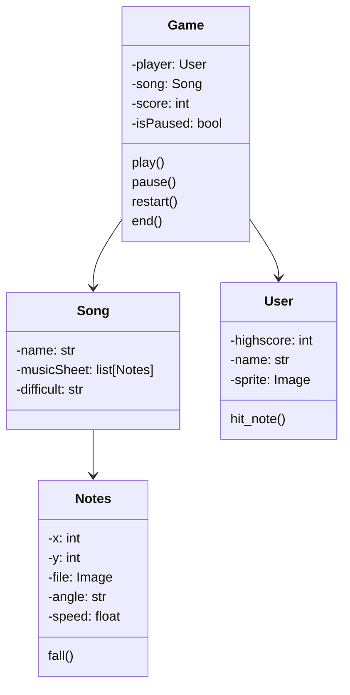

### This READ.md template was written based on this [repository](https://github.com/FernandoSchett/github_readme_template).

<h1 align="center">🪗 Guitar Hero do Forró 🪗</h1>

<div align="center">
	<a href="link_for_webite">
	
    </a>
</div>

## Developed by 💻:

- [Arthur dos Santos Silva]() - Implemented a method for varied scoring, adding points depending on where the player presses to make the note disappear.
Updated the documentation to meet the project's requirements.
- [Artur Mota]() - Adding scoring function per click (without scoring rays). Adding dynamic background and character. Generating random sheet music and left-right hitbox.
- [Fernando Schettini](https://github.com/FernandoSchett) - New Docs, and project arquitecture.
- [Bruna Anunciação]() - Implementing function for note disappearance. Creating menu for game start and difficulty selection. Creating menu for song selection.
- [João Paulo Gomes Bernardino]() - Documentation modeling. Project setup, initial scope. Adding player. Adding music to the project with pygame.
- [Victoria Beatriz]() - Implemented scoring function. Adding Easy, Medium, and Hard difficulty modes.

## About 🤔:

For the final assignment of the Object-Oriented Programming course, the team chose to develop a project in the style of "Guitar Hero," where the player needs to press the keys at the right moment according to the notes of the music displayed on the screen. During the project implementation, it was possible to apply several concepts learned throughout the semester.

### Gameplay 🎮:

At first, you can choose one of five songs. After selecting the song, the user must choose the difficulty level of the gameplay: easy, medium, or hard.

During the gameplay, musical notes will be displayed on the screen as descending lines towards an area with arrow markings. When the notes reach these regions, the player must press the corresponding arrow keys on the keyboard. If they hit the exact moment, the player's score will increase. If they press at the wrong time or don't press at all, the score will be reduced.

## Resourses 🧑‍🔬:

- Song selection: Players can choose from 5 different songs to play.

- Multiple difficulties: Each song has 3 different difficulty levels, allowing players to adjust the challenge according to their skills.

- Increased tempo: As the player hits more keys correctly, the game's tempo accelerates, increasing the challenge.

- Doubled points: If the player hits many consecutive keys accurately, they earn double points, incentivizing the player to maintain rhythm and accuracy.

- "Jurema": Throughout the game, a character named Jenny dances to the sound of the music, adding a visual element to the game.

## Dependencies 🚚:

The project dependencies are described in  ```./dependencies/requirements.``` within the repository. In summary, heres what you're gonna need in order to run the project:

- [```pygame 2.5.0```](http:link.com).
- [```tupy```](https://github.com/rodrigorgs/tupy).

For installing dependencies more quickly, you can run the following command at terminal, inside the clonned repository:

    sudo apt update && sudo apt install python3 python3-pip
    pip3 install -r ./dependencies/requirements.txt

Make sure you have all Dependencies before running the project.

## How to run it 🏃:

First, clone this repository. After that, simply execute the ```main.py``` file with the command:

    python main.py

## How to install 🔬:

## Screens 🎬:

Guitar Hero do Forró screens were developed to turn out like Figure 1.

<div align="center">
	<a href="">
	
    </a>
</div>
<h4 align="center">Figure 1 - Screens from Guitar Hero do Forró </h4>


## UML‍ 💬:

Heres the UML that represents how the application works with their classes.



<h4 align="center">Figure 2 - Guitar Hero do Forró UML.</h4>

## Development Process ⚙️:

Developers used [Trello]() to get things organized, each one using their own branch to code, using names to identify the commit type then merginng the features into develop branch. After testing, the group update the main branch. This application was developed in xx/xx/20xx until xx/xx/20xx.

### Tools Used 🛠️: 

- [VScode](https://code.visualstudio.com/). 
-
-
	
## How to contribute 🫂:

Feel free to create a new branch, fork the project, create a new Issue or make a pull request contact one of us to develop at Guitar Hero do Forró.

## Licence 📜:

[Apache V2](https://choosealicense.com/licenses/apache-2.0/)
